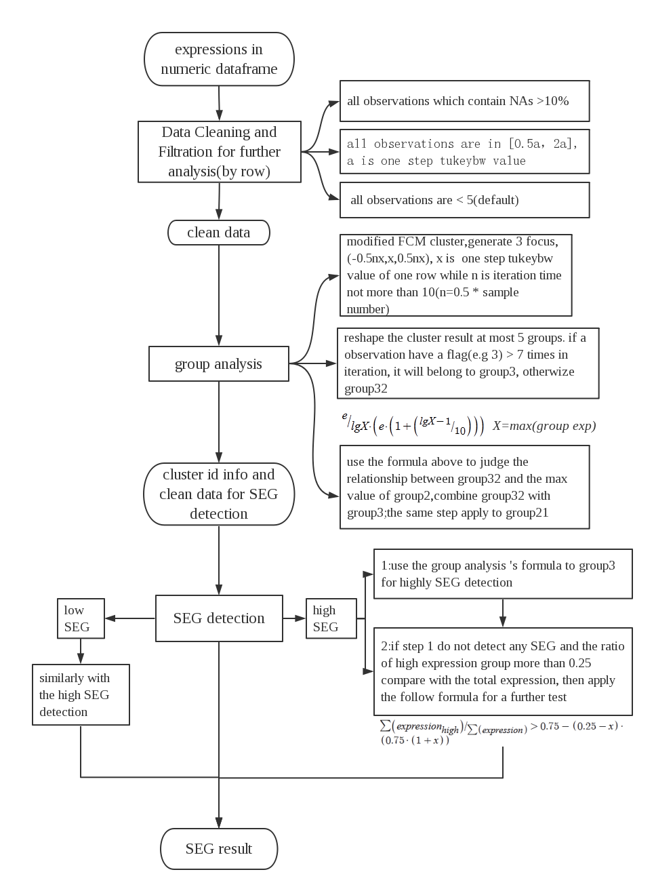

# SEGtool

> [Qiong Zhang, Wei Liu, Chunjie Liu, Sheng-Yan Lin, An-Yuan Guo. SEGtool: a specifically expressed gene detection tool and applications in human tissue and single-cell sequencing data. Briefings in Bioinformatics, 2017; doi: 10.1093/bibx074.](https://academic.oup.com/bib/article/doi/10.1093/bib/bbx074/3933283/SEGtool-a-specifically-expressed-gene-detection)

## Introducntion

SEGtool is an R package with self-adaptive function and high accuracy for specifically expressed gene (SEG, also known as tissue specific gene) detection. SEGs are essentially outliers in a given condition (or different treatments, tissues). In order to detect such outliers, SEGtool combines modified fuzzy c-means (FCM), Jaccard index and greedy annealing methods to detect SEGs. SEGtool can intellectually detect both high and low SEGs in numeric expression dataset. It provide a HTML results page which contains an overall insight of the SEGs information for the entire dataset. The SEGtool package is easy-to-use and suitable for different types expression data. It requires an input of matrix with gene expression in numeric-scale, e.g. processed microarray dataset (RMA or MAS processed value) or RNA-seq expression (rpm, rpkm, fpkm, rsem etc.).

## Workflow

## Features

1. High and low SEGs detection.
2. Specific expression patterns detection.
3. Detect extreme values in numeric-scale format.

## System requirement

This package can be used in UNIX/LINUX and was developed under R 3.1.1 on the ubuntu 12.04 operating system. The package on WINDOWS OS could not call multi-core cpu for speeding , and only perform on single core. The memory occupation depends on the sample size of the input datasets. 336M RAM and 4min were taken in an E7-4820 computer using 4 Cores while handling 39 tissues that all of them have 60533 genes (EBI test dataset, each cell is float with 4 significant figures). SEGtool used 336M RAM and 8min to complete the SEG analysis using default parameters on GTEx dataset (56238 genes in 53 tissues). Because of the time consumings, default option will not draw plot figure for each SEG's expression (or this it will spend a long time). In order to implement our package, the R software and following R packages including : ggplot2 (single gene expression plot figure needed) hwriterPlus ( UNIX/LINUX html report needed ) parallel ( R contributed packages,UNIX/LINUX platform run multi-cpu required ) pheatmap ( heatmap needed) svglite ( html report needed ) All the packages required can be downloaded from CRAN or BIoconductor or click the hyperlinks above.

## Procedures

- Specific Expression Patterns Detection, using a Tukey-biweight modified fuzzy C-mean(FCM) clustering algorithm method
- Principle Component Analysis (PCA) for the samples with SEGs
- Cluster analysis for genes and samples
- Represent SEGs in different samples
- Plotting all the analysis results
- Generate html report
